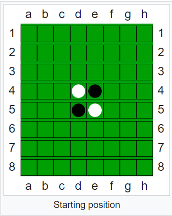
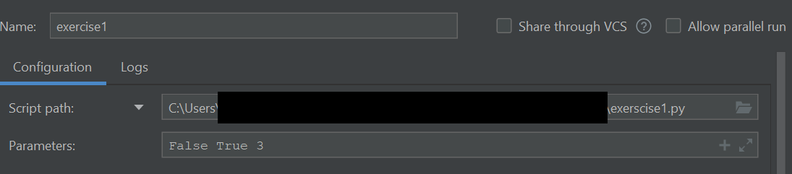
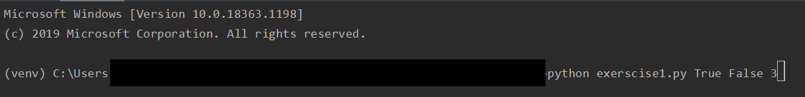

<h1 align="center"> 1η Εργασία μαθήματος "Τεχνητή Νοημοσύνη" ΟΠΑ 2020-2021 </h1>

## Ομάδα
|  ***Ονοματεπώνυμο***                  |**ΑΜ** |
|:---:                                  |:---:  |
| Γαλιατσάτου Βασιλική                  |3120024|
| Μπούσουλας-Ραϊκίδης Ορφέας-Γιώργος    |3160111|
| Κοιλάκος Παναγιώτης                   |3140081|

## Γενικά

Για την εργασία επιλέξαμε να υλοποιήσουμε τη 2η άσκηση και συγκεκριμένα το
παιχνίδι [Othello](https://en.wikipedia.org/wiki/Reversi#Othello).

Περιληπτικά, το Othello είναι ένα παιχνίδι δυο παικτών στο οποίο έχουμε ένα ταμπλο και πούλια δυο χρωμάτων, μαύρα και
λευκά   
(dark and light για τους σκοπούς της άσκησης). Για την απεικόνιση του παιχνιδιού χρησιμοποιούμε τη γραμμή εντολών. Σε
κάθε στάδιο του παιχνιδιού εμφανίζουμε ένα ταμπλό με το γράμμα D να αναπαριστά τα μαύρα πούλια, το γράμμα L τα λευκά και
το γράμμα Χ τις δυνατές κινήσεις που μπορεί να κάνει ο παίκτης, εάν επιθυμεί να τις βλέπει. Τα κενά κελιά δεν περιέχουν
πούλια.

By convention τα πούλια είναι τοποθετημένα διαγώνια στο κέντρο του ταμπλό με τα μαύρα να βρίσκονται στην πάνω δεξιά
και   
κάτω αριστερή γωνία.

###### Η κατάσταση εκκίνησης του παιχνιδιού
  
###### Source: [Othello](https://en.wikipedia.org/wiki/Reversi#Othello)

Οι κινήσεις που μπορούν να γίνουν είναι αυτές οι οποίες επιτρέπουν τον σχηματισμό μιας οριζόντιας, κάθετης ή διαγώνιας γραμμής  
μεταξύ δυο πουλιών ιδίου χρώματος, τα οποία παρεμβάλονται όμως από πούλια αντιθέτου χρώματος. Τα πούλια αυτά "καταλαμβάνονται" και αλλάζουν χρώμα.

Οι τελικές καταστάσεις έχουν μια από τις ακόλουθες μορφές:  
1. Το ταμπλό έχει γεμίσει με πούλια διαφόρων χρωμάτων. Νικητής είναι αυτός με τα περισσότερα πούλια που έχουν το χρώμα του  
και κερδίζει με σκόρ όσα είναι τα πιόνια του ενώ ο αντίπαλος χάνει με σκορ επίσης όσα είναι τα πιόνια του.
2. Το ταμπλό δεν έχει γεμίσει αλλά δεν υπάρχουν άλλες κινήσεις για κανέναν από τους δυο παίκτες. Και οι δυο παίχτες
   έχουν  
   τουλάχιστον ένα πούλι στο ταμπλό. Κερδίζει αυτός με τα περισσότερα πούλια που έχουν το χρώμα του και κερδίζει με σκορ
   όσα είναι τα πιόνια του, ενώ ο αντίπαλος χάνει με σκορ επίσης όσα είναι τα πιόνια του.
3. Ένας παίχτης μένει χωρίς κανένα πούλι στο ταμπλό (κατελήφθησαν όλα από τον αντίπαλο) και συνεπώς δεν υπάρχουν άλλες
   κινήσεις.  
   Κερδίζει ο παίκτης που έχει πούλια στο ταμπλο και κερδίζει με σκορ 64-0 έναντι του αντιπάλου.

## Τρόπος χρήσης <a name="use"></a>

Για την εκτέλεση του προγράμματος δεν απαιτείται μεταγλώττιση. Ωστόσο, είναι αναγκαίο να υπάρχει εγκατεστημένη η python

3.

**Για την επιτυχή εκτέλεση του προγράμματος απαιτείται να είναι εγκατεστημένες οι βιβλιοθήκες της
Python: ```numpy, copy, argparse, typing```**

Εκτέλεση:

1. Αποσυμπιέστε το αρχείο .zip.
2. Ανοίξτε ένα τερματικό (γραμμή εντολών στα Windows) και πλοηγηθείτε με την εντολή ```cd``` στο φάκελο που περιέχονται
   τα αρχέια .py .
3. Τρέξτε στο τερματικό την εντολή ```python3 exerscice1.py [player_first] [print_output] [difficulty]```

Σε κάθε περίπτωση οι παράμετροι είναι:

- player_first: True ή False που προσδιορίζει αν ο παίκτης παίζει πρώτος
- print_output: True ή False που προσδιορίζει αν θέλουμε να φαίνονται οι πιθανές κινήσεις όταν παίζει ο παίκτης
- difficulty: Int από 1 έως και 10 που προσδιορίζει το depth του minimax (επίπεδο δυσκολίας)
- -h  : Προαιρετική παράμετρος που παρουσιάζει την βοήθεια για τη χρήση του προγράμματος

###### Παραμετροποίηση PyCharm



###### Παραμετροποίηση cmd



## Αρχιτεκτονική

Ο κώδικας έχει σχεδιαστεί σε 4 διαφορετικά .py αρχεία. Τα αρχεία αυτά είναι:

- [board.py](#brd) που περιέχει την κλαση του πίνακα (ταμπλό) και σχετικές μεθόδους
- [othello.py](#oth) που περιέχει την κλάση του παιχνιδιού και σχετικές μεθόδους. Επίσης αναλαμβάνει το gameplay
- [exerscise1.py](#exe) που περιέχει την main function που εκινεί το gameplay και κάνει το argument handling
- [minimax.py](#mm) που υλοποιεί την τεχνική minimax με α-β πριόνισμα για εξοικονόμηση χώρου και χρόνου

### board.py <a name="brd"></a>
Η κλάση board που περιέχεται στο board.py έχει οριστεί έτσι ώστε να μπορούμε να κατασκευάζουμε στιγμιότυπα πινάκων (ταμπλό),  
ανεξάρτητα από το gameplay.  
  
  Εκτός από την κλάση board περίεχονται και βοηθητικές μέθοδοι που διαχειρίζονται το input και την πρόσβαση στον πίνακα  
(δεν θα αναφερθούν αναλυτικά για λόγους συντομίας).
  
  
Περιέχονται οι εξής μέθοδοι:
- \_\_init__   
Πρόκειται για μια μέθοδο η οποία αναλαμβάνει να κάνει το initialization οποιουδήποτε instance της κλάσης. Πρόκειται δηλαδή  
περι κατασκευαστή που ανάλογα με τα ορίσματα που δέχεται αρχικοποιεί τις μεταβλητές του instance της κλάσης.
- create_board  
Πρόκειται για μια μέθοδο η οποία δημιουργεί την 2d λίστα στην αρχή του παιχνιδιού (αρχική κατάσταση). Είναι και η μοναδική  
στατική μέθοδος της κλάσης.   
- set_board
  Δέχεται ως ορίσματα πληροφορίες σχετικές με την κατάσταση του παιχνιδιού και του πίνακα (π.χ. εισαγώμενη κίνηση,   
  χρώμα παίχτη, χρώματα των παικτών και την λίστα ιστορικότητας). Αναλαμβάνει την εισαγωγή ενός πιονιού σε κάποιο σημείο  
  του πίνακα(ταμπλό). Μεταξύ άλλων ελέγχει αν η κίνηση είναι έγκυρη (μέσω άλλης μεθόδου), αποφασίζει για το χρώμα που θα  
  βάλει, ορίζει την πιο  πρόσφατη κίνηση που έγινε, είσαγει την κίνηση στο ιστορικό κινήσεων και τελικά "γυρίζει" το χρώμα  
  των πιονιών του αντιπάλου με την χρήση άλλης μεθόδου.  
  
  Επιστρέφει τόσο την κίνηση που έγινε όσο και την ανανεωμένη λίστα ιστορικού. Αν η κίνηση δεν είναι έγκυρη επιστρέφει   
  μήνυμα λάθους.
  - move_exists  
  Πρόκειται για βοηθητική μέθοδο η οποία ελέγχει αν η επιθυμητή κίνηση βρίσκεται στον κατάλογο έγκυρων κινήσεων.  
    
    Επιστρέφει True αν υπάρχει και False αν δεν υπάρχει.
  
- print_board  
Πρόκειται για μία μέθοδο η οποία εκτυπώνει τον πίνακα σε human friendly μορφή
- flip_opponent_pieces  
Πρόκειται για μια μέθοδο η οποία αναστρέφει τα χρώματα των αντιπάλων μετά από μια κίνηση.
  
  Δέχεται ως ορίσματα πληροφορίες σχετικές με την κατάσταση του παιχνιδιού και του πίνακα (π.χ. το πούλι που τοποθετήσαμε  
και τον δράστη την συγκεκριμένη χρονική στιγμή). Αναλαμβάνει να κάνει όλους τους ελέγχους και τελικά να αναστρέψει τα πούλια  
τα οποία πρέπει να αναστραφούν σύμφωνα με την κίνηση. Πιο συγκεκριμένα ελέγχει διαγώνια, οριζόντια και κάθετα για  
σχηματιζόμενες ευθείες μεταξύ του τοποθετημένου πιονιού και κάποιου άλλο πιονιού του ίδιου χρώματος. Όταν εντοπίσει τέτοιες  
ευθείες αναστρέφει το χρώμα των πιονιών.  
  
  Επιστρέφει τον πίνακα με ανανεωμένα τα αναστρεμένα πούλια. 
- find_moves  
Πρόκειται για μια μέθοδο η οποία βρίσκει τις πιθανές έγκυρες κινήσεις ανάλογα με την καστάσταση του πίνακα (ταμπλό) και με το  
ποιος παίζει.
  
  Δέχεται ως ορίσματα πληροφορίες για τον παίκτη μια συγκεκριμένη χρονική στιγμή. Αναλαμβάνει να κάνει όλους τους ελέγχους και  
τελικά να παρουσιάσει τις πιθανές έγκυρες κινήσεις. Πιο συγκεκριμένα ελέγχει διαγώνια, οριζόντια και κάθετα για θέσεις γειτονικές
στα αντίπαλα πούλια στις οποίες δημιουργείτε ευθεία.
  
  Επιστρέφει τις πιθανές έγκυρες κινήσεις.
- get_children  
Πρόκειται για μια μέθοδο η οποία δοθείσας μιας κατάστασης πίνακα (και του χρώματος του τρέχοντος παίκτη), δημιουργεί instances  
της κλάσης board για όλες τις πιθανές κινήσεις του δοθέντος πίνακα.  
  
  Επιστρέφει έναν κατάλογο που περιέχει instances της τάξης board.
- check_win_conditions  
Πρόκειται για μια μέθοδο η οποία ελέγχει τις συνθήκες τερματισμού, εκτυπώνει το σκορ και επιστρέφει το initial του νική  
(p για player ή c για computer).  
  
  Δέχεται ως ορίσματα τα χρώματα των παικτών και αν θέλουμε να προχωράει σε εκτύπωση του ταμπλό.
  
  Επιστρέφει το initial του νικητή.
- evaluate  
Πρόκειται για μια μέθοδο η οποία ελέγχει τον πίνακα και "δίνει" ένα σκορ ανάλογα με την τρέχουσα βαθμολογία. Είναι και η πρώτη  
μέθοδος που χρησιμοποιείτε άμεσα από το minimax.  
  
  Δέχεται ως όρισμα το χρώμα του υπολογιστή, αποφασίζει το χρώμα του παίκτη και διατρέχει σειρές και στείλες για να προσμετρήσει  
  το σκορ (ποιος προηγείται) αυξάνοντας έναν μετρητή λευκών και μαύρων πιονιών. Σε περίπτωση που προκύπτει νίκη ενός από τους  
  δυο αποφασίζει και προσθέτει 100 πόντους στον νικητή.  
  
  Επιστρέφει την συνολική τιμή του πίνακα (θετική κερδίζει ο υπολογιστής, αρνητική κερδίζει ο παίκτης)
### othello.py <a name="oth"></a>
Η κλάση Game που περιέχεται στο othello.py έχει οριστεί έτσι ώστε να μπορούμε να διαχειριζόμαστε το gameplay.   
Εκτός από την κλάση game περίεχονται και βοηθητικές μέθοδοι που διαχειρίζονται το input και την πρόσβαση στον πίνακα  
(δεν θα αναφερθούν αναλυτικά για λόγους συντομίας), όπως και μια μέθοδο που εκκινεί το παιχνίδι.
  
Περιέχονται οι εξής μέθοδοι:
- \_\_init__  
Πρόκειται για μια μέθοδο η οποία αναλαμβάνει να κάνει το initialization οποιουδήποτε instance του game. Πρόκειται δηλαδή
περι κατασκευαστή που ανάλογα με τα ορίσματα που δέχεται αρχικοποιεί τις μεταβλητές του instance της κλάσης.  
- set_color  
Πρόκειται για μια μέθοδο η οποία προσδιορίζει ποιο χρώμα έχω ο κάθε παίκτης.  
  
  Δέχεται ως όρισμα το αν ο παίκτης έχει επιλέξει να παίξει πρώτος και ανάλογα θέτει τα χρώματα του παίκτη και του υπολογιστή.  
  
  Θέτει στις μεταβλητές της κλάσης το χρώμα του κάθε παίκτη όπως και το ποιος παίζει την δεδομένη χρονική στιγμή.
- print_history  
Πρόκειται για μια μέθοδο η οποία διατρέχει την λίστα με την ιστορικότητα των κινήσεων και τις εκτυπώνει αν ζητηθεί από  
τον παίκτη.
- turn  
Πρόκειται για μια μέθοδο η οποία εναλάσσει τις κινήσεις των παικτών.  
  
  Είτε εναλλάσει τον τρέχοντα παίκτη ή επιστρέφει True που σημαίνει ότι δεν υπάρχουν επιπλέον κινήσεις.
- player_move  
Πρόκειται για μια μέθοδο η οποία ορίζει το τι συμβαίνει όταν παίζει ο παίκτης, καλόντας μια βοηθητική μέθοδο.
- handle_player_input  
Πρόκειται για μια μέθοδο η οποία καλείτε από την player_move και ζητάει/αποθηκεύει τις επιλογές του παίκτη.  
  
  Δέχεται ως ορίσματα την κίνηση του παίχτη, κάνει έλεγχο ορθότητας και ανάλογα με την επιλογή του παίκτη καλεί την κατάληλη  
  μέθοδο είτε εκτύπωσης του ιστορικού ή της αλλαγής του ταμπλό (από την τάξη board).
- computer_move  
Ομοίως με την player_move πρόκειται για μια μέθοδο η οποία ορίζει το τι συμβαίνει όταν παίζει ο παίκτης.  
  
  Εδώ αφαρμόζεται και το AI.
- reset_all_marks  
Πρόκειται για μια μέθοδο η οποία επιστρέφει το ταμπλό στην κατάσταση που βρισκόταν (πριν εμφανιστού οι πιθανές κινήσεις)  
- set_possible  
Πρόκειται για μια μέθοδο η οποία διατρέχει τις πιθανές έγκυρες κινήσεις και παρουσιάζει στο ταμπλό με ένα 'Χ' τις θέσεις  
τους. Ο πίνακας επιστρέφει στην προηγούμενη μορφή όταν χρειαστεί με την χρήση της reset_all_marks  
- play  
Μια συνάρτηση που περιέχει έναν ατέρμονα βρόγχο και τερματίζει μόνο στην περίπτωση που έχει κερδίσει κάποιος παίκτης (με  
την βοήθεια της check_win_condition της τάξης board)
- start_game  
Πρόκειται για μια μέθοδο η οποία εκκινεί το παιχνίδι.  
  
  Δέχεται ως όρισμα το αν θέλει ο παίκτης να παίξει πρώτος, αν θέλει να φαίνονται οι δυνατές κινήσεις και το επίπεδο δυσκολίας.  
  
  Δημιουργεί ένα instance της τάξης game και την επιστρέφει. 
### exerscise1.py <a name="exe"></a>
To αρχείο exerscise1.py περιέχει όλες τις μεθόδος και μια main που χρειάζεται το παιχνίδι για να εκκινήσει.  
  
  Περιέχονται οι εξής μέθοδοι:
- print_hi  
Πρόκειται για μια μέθοδο η οποία εκτυπώνει το μήνυμα καλοσωρίσματος αφότου δεχθεί το όνομα του χρήστη. 
- parse_arguments  
Πρόκειται για μια μέθοδο η οποία δέχεται τα ορίσματα τα οποία απαιτούνται για την εκτέλεση του προγράμματος.  

  [Περισσότερες πληροφορίες παραμέτρων εκτέλεσης](#use)
- \_\_main__  
H main κάνει unpack τα command line arguments σε μεταβλητές (και διαχειρίζεται και τα εσφαλμέντα arguments), δημιουργεί  
ένα Instance της τάξης Game και εκκινεί το παιχνίδι.
### [minimax.py](#ai) <a name="mm"></a>
Η minimax.py περιέχει τις μεθόδους που απαιτούνται για την υλοποίηση του AI με την μέθοδο MiniMax με πριόνισμα α-β.  
  
  Περιέχονται οι εξής μέθοδοι:
- minimax_move  
Πρόκειται για την μέθοδο η οποία εκκινεί τον αλγόριθμο minimax καλόντας την maximize συνάρτηση.  
   
   Δέχεται ως ορίσματα ένα instance μιας τάξης board, το μέγιστο βάθος, το χρώμα του παίκτη και το χρώμα του υπολογιστή..
     
   Επιστρέφει μια κίνηση σε μορφή tuple.
- maximize  
Πρόκειται για μια μέθοδο η οποία εφαρμόζει την minimax από την πλευρά του maximizer (θέλει να πετύχει το μέγιστο σκορ).  
Πάντα στην δικιά μας περίπτωση ο maximizer θα είναι ο υπολογιστής.
  
  Δέχεται ως όρισμα ένα instance της τάξης board , το τρέχων βάθος, το μέγιστο βάθος, το άλφα και το βήτα για το πριόνισμα.
  
  Αρχικά ελέγχει αν εκπληρώνονται τα win conditions και αν ναι τότε η συνάρτηση επιστρέφει το Instance. Αν όχι τότε γίνεται  
  evaluate η χειρότερη κατάσταση για τον maximizer (σκορ -64) και δημιουργούνται τα παιδιά του τρέχοντος instance του board.
  Για κάθε παιδί καλείται η συνάρτηση min, γίνεται evaluation και ελέγχονται οι συνθήκες για το α-β πριόνισμα.
- minimize  
Πρόκειται για μια μέθοδο η οποία εφαρμόζει την minimax από την πλευρά του minimizer. Πάντα στην δικιά μας περίπτωση ο  
minimizer θα είναι ο παίκτης.
  
  Αντίστοιχα με τον maximizer, δέχεται ως όρισμα ένα instance της τάξης board, το τρέχων βάθος, το μέγιστο βάθος,   
  το άλφα και το βήτα για το πριόνισμα.
  
  Αρχικά ελέγχει αν εκπληρώνονται τα win conditions και αν ναι τότε η συνάρτηση επιστρέφει το Instance. Αν όχι τότε γίνεται  
  evaluate η χειρότερη κατάσταση για τον minimizer (σκορ 64) και δημιουργούνται τα παιδιά του τρέχοντος instance του board.
  Για κάθε παιδί καλείται η συνάρτηση max, γίνεται evaluation και ελέγχονται οι συνθήκες για το α-β πριόνισμα.
## Μέθοδος Τεχητής Νοημοσύνης <a name="ai"></a>
Στην εργασία χρησιμοποιήθηκε ο αλγόριθμος Minimax
### Περιπτώσεις χρήσης
Ο αλγόριθμος minimax πρόκειται για έναν DFS αλγόριθμο ο οποίος χρησιμοποιείται στην τεχνητή νοημοσύνη, στην θεωρία παιγνίων    
και στην θεωρία αποφάσεων. Συγκεκριμένα για την χρήση σε παίγνια, εφαρμόζεται τόσο σε παιχνίδια γενικής φιλοσοφίας, σε παιχνίδια  
μηδενικού αθροίσματος και σε επαναλαμβανόμενα παιχνίδια.
### Ο minimax
Ο αλγόρθμος minimax είναι ένας αναδρομικός αλγόριθμος ο οποίος βρίσκει την βέλτιστη κίνηση για έναν παίκτη, με την προυπόθεση  
ότι ο αντίπαλος παίζει και αυτός βέλτιστα. Ο αλγόριθμος βασίζεται στην λογική ότι ο κυρίως παίκτης στοχεύει στο μέγιστο   
κέρδος (max), εξασφαλίζοντας ταυτόχρονα το ελάχιστο κέρδος για τον αντίπαλό του. Ο αλγόριθμος ξεκινάει από την ρίζα και   
κατεβαίνει προς τα κάτω σε ένα δέντρο. Το δέντρο σταματάει σε ένα maximum depth ή στην τελικά κατάσταση του παιχνιδιού   
(αν σταματήσει στο μέγιστο δοσμένο βάθος τότε πρόκειται και για dfs με περιορισμό βάθους, αλλιώς πρόκειται για απλό dfs   
με τεράστια πολυπλοκότητα). Όταν φτάσει στα φύλλα γίνονται evaluate οι καταστάσεις και συγκρίνονται οι καταστάσεις ώστε   
να βρεθεί η βέλτιστη για τον maximizer και χείριστη για τον minimizer γυρνώντας προς τα πίσω.
  
  Εναλλακτικά, αν σκεφτούμε τις καταστάσεις ως ένα δέντρο όπου στην ρίζα του βρίσκεται μια αρχική κατάσταση τότε κατεβαίνουμε  
  με χρήση DFS στο δέντρο. Για κάθε εναλλαγή επιπέδου χρησιμοποιούμε εναλλάξ τον maximize αλγόριθμο για να πετύχουμε   
  μέγιστο αποτέλεσμα και μετά τον minimize στο επόμενο επίπεδο για να πετύχουμε ελάχιστο αποτέλεσμα για τον αντίπαλό μας.
  Έτσι από τα φύλλα (έχουμε κατέβει από την ρίζα) ανεβαίνουμε στο επίπεδο φύλλο-1 εφαρμόζοντας την min ή την max για   
  όλους τους κόμβους του επιπέδου.  Ύστερα συνεχίζουμε από το επίπεδο φύλλο-1 στο επίπεδο φύλλο-2 εφαρμόζοντας τον αντίθετο  
  αλγόριθμο από αυτόν που χρησιμοποιήσαμε πριν για όλους τους κόμβους.  
  
  ###### Γραφικά ο αλγόριθμος minimax

###### Source: [Minimax](https://en.wikipedia.org/wiki/Minimax)

### α-β πριόνισμα
Ο αλγόριθμος του α-β πριονίσματος όταν εφαρμοστεί με έναν αλγόριθμο minimax τότε επιστρέφει την λύση που θα επέστρεφε και  
ο απλός minimax, πριονίζοντας όμως συγκεκριμένα κλαδιά (δεν τα εξετάζει), μειώνοντας έτσι την χρονική και χωρική πολυπλοκότητα.  
Η τιμή alpha είναι η βέλτιστη τιμή του evaluation function που έχει επιστραφέι για τον max και η beta είναι η βέλτιστη  
  τιμή του evaluation function που έχει επιστραφεί για τον min. Έτσι αν ο αλγόριθμος συναντήσει αλυσίδα καταστάσεων   
  στο max ή στο min με χειρότερη τιμή του alpha ή του beta αντίστοιχα, τότε δεν τις εξετάζει.
  
  Εναλλακτικά, αν σκεφτούμε τις καταστάσεις ως ένα δέντρο όπου στην ρίζα του βρίσκεται μια αρχική κατάσταση τότε κατεβαίνουμε  
  με χρήση DFS στο δέντρο. Για κάθε εναλλαγή επιπέδου χρησιμοποιούμε εναλλάξ τον maximize αλγόριθμο για να πετύχουμε   
  μέγιστο αποτέλεσμα και μετά τον minimize στο επόμενο επίπεδο για να πετύχουμε ελάχιστο αποτέλεσμα για τον αντίπαλό μας.
  Έτσι από τα φύλλα (έχουμε κατέβει από την ρίζα) ανεβαίνουμε στο επίπεδο φύλλο-1 εφαρμόζοντας την min ή την max για   
  όλους τους κόμβους του επιπέδου. Ύστερα συνεχίζουμε από το επίπεδο φύλλο-1 στο επίπεδο φύλλο-2 εφαρμόζοντας τον αντίθετο  
  αλγόριθμο από αυτόν που χρησιμοποιήσαμε πριν για όλους τους κόμβους. Όμως αν συναντήσουμε κλαδιά στα οποία έχει ανατεθεί  
  ήδη μια τιμή η οποία είναι χειρότερη του alpha (για επίπεδα max) ή του beta (για επίπεδα min), τότε δεν τα εξετάζουμε   
  και συνεχίζουμε με άλλα κλαδιά.
  
  ###### Γραφικά ο αλγόριθμος minimax με α-β πριόνισμα

###### Source: [Alpha-beta pruning](https://en.wikipedia.org/wiki/Alpha%E2%80%93beta_pruning)  
### O αλγόριθμος minimax με α-β πριόνισμα στο Othello
Ο αλγόριθμος εφαρμόστηκε ώς εξής στην εργασία.  
Για μια δεδομένη κατάσταση στην οποία καλούμαστε να βρούμε βέλτιστη κίνηση:  
1. Καλούμε τον αλγόριθμο max
2. Ελέγχουμε αν πρόκειται για τελική κατάσταση. Αν ναι επιστρέφουμε ότι αποτέλεσμα έχουμε ως αποδοτικότερη κίνηση, αλλιώς  
συνεχίζουμε
3. Για όλα τα παιδιά της κατάστασης στην οποία βρισκόμαστε:
     1. Καλούμε τον αλγόριθμο min και θέτουμε την επιστρεφόμενη τιμή ως εξεταζόμενη κίνηση
     2. Αφότου επιστρέψουμε από τον αλγόριθμο min ελέγχουμε αν το evaluation της επεστραμένης κίνησης είναι μεγαλύτερο ή ίσο  
     από το evaluation της τρέχουσας βέλτιστης κατάστασης. Αν είναι καλύτερη τότε θέτουμε νέα βέλτιστη και συνεχίζουμε.  
     Αλλιώς συνεχίζουμε χωρίς να θέσουμε νέα βέλτιστη κατάσταση
     3. Ελέγχουμε αν το evaluation της τρέχουσας βέλτιστης κατάστασης είναι καλύτερο ή ίσο από το beta. Αν ναι επιστρέφουμε την  
     βέλτιστη κατάσταση. Αν όχι συνεχίζουμε.
     4. Ελέγχουμε αν το evaluation της τρέχουσας βέλτιστης κατάστασης είναι καλύτερο από το alpha. Αν ναι θέτουμε νέο alpha  
     το evaluation της τρέχουσας βέλτιστης κατάστασης και συνεχίζουμε. Αν όχι συνεχίζουμε χωρίς αλλαγής του alpha.
     5. Επιστρέφουμε
4. Ελέγχουμε αν πρόκειται για τελική κατάσταση. Αν ναι επιστρέφουμε ότι αποτέλεσμα έχουμε ως αποδοτικότερη κίνηση, αλλιώς
συνεχίζουμε
5. Για όλα τα παιδιά της κατάστασης στην οποία βρισκομαστε:
     1. Καλούμε τον αλγόριθμο max και θέτουμε την επιστρεφόμενη τιμή ως εξεταζόμενη κίνηση
     2. Αφότου επιστρέψουμε από τον αλγόριθμο max ελέγχουμε αν το evaluation της επεστραμένης κίνησης είναι μικρότερο ή ίσο   
     από το evaluation της τρέχουσας βέλτιστης κατάστασης. Αν είναι μικρότερο τότε θέτουμε νέα βέλτιστη και συνεχίζουμε.  
     Αλλιώς συνεχίζουμε χωρίς να θέσουμε νέα βέλτιστη κατάσταση.
     3. Ελέγχουμε αν το evaluation της τρέχουσας βέλτιστης κατάστασης είναι μικρότερο ή ίσο από το alpha. Αν ναι επιστρέφουμε την  
     βέλτιστη κατάσταση. Αν όχι συνεχίζουμε.
     4. Ελέγχουμε αν το evaluation της τρέχουσας βέλτιστης κατάστασης είναι μικρότερο από το beta. Αν ναι θέτουμε νέο beta  
     το evaluation της τρέχουσας βέλτιστης κατάστασης και συνεχίζουμε. Αν όχι συνεχίζουμε χωρίς αλλαγής του beta.
     5. Επιστρέφουμε
6. Επαναλαμβάνουμε τα βήματα 1-5
## Συμπεράσματα
Η εφαρμογή του αλγορίθμου έγινε σε δυο βήματα. Πρώτα έγινε η κατασκευή του αλγορίθμου minimax και ελέγχθηκαν τα αποτελέσματα.  
Παρατηρήθηκε ότι ειδικά προς το end game ή σε οποιοδήποτε σημείο του παιχνιδιού για μεγάλα βάθη, ο αλγόριθμος ήταν πολύ αργός.  
Μετά την εφαρμογή του πριονίσματος ελέγξαμε τους χρόνους για τις ίδιες ακριβώς κινήσεις και είχαμε μείωση του χρόνου ακόμη  
και στο 1/10 αν όχι παραπάνω του αρχικού χρόνου (παραπάνω από 90% βελτίωση).Φυσικά τα αποτελέσματα ήταν τα ίδια με τον απλό  
minimax όμως αισθητά πιο άμεσα.
  


